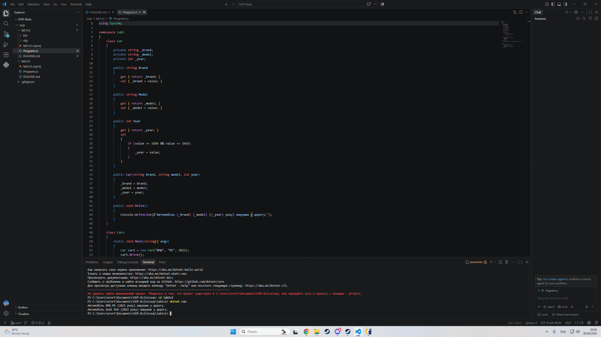

Звіт з лабораторної роботи №1
Студент: Варіант №2 (Клас Car)

Тема: Класи, об’єкти, конструктори та деструктори у C#

Хід роботи та навички
Налаштував середовище: Встановив VS Code з розширеннями C# та створив проєкт через CLI.

Реалізував клас Car: Додав приватні поля, публічні властивості з валідацією, конструктори (: this()), метод дій та деструктор.

Продемонстрував ООП: У Main створив 3 об'єкти, викликав їхні методи та продемонстрував роботу GC.Collect().

Налаштував Git: Додав .gitignore, створив коміт та завантажив проєкт на GitHub.

Результати
Контрольні запитання
1. Перевантаження конструкторів: Створення кількох конструкторів із різними параметрами. Дає гнучкість при ініціалізації об'єктів.

2. Конструкція : this(): Викликає один конструктор з іншого, виключаючи дублювання коду ініціалізації.

3. Виклик деструктора: Викликається Garbage Collector у фоновому потоці автоматично, коли об'єкт стає недосяжним.

4. Ручний GC.Collect(): Не рекомендовано, бо призупиняє роботу програми та погіршує продуктивність.

