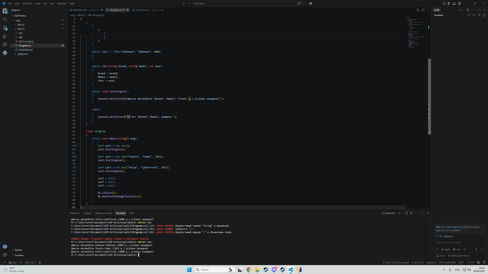

Звіт з лабораторної роботи №2
Студент: Варіант №2 (Клас Car)

Тема: Клас із кількома конструкторами. Життєвий цикл об’єкта

Хід роботи та навички
Створив проєкт: Ініціалізував проєкт lab2v2 у директорії OOP-Bzita/oop/lab2v2 через .NET CLI.

Реалізував клас Car:

Описав приватні поля _brand, _model, _year.

Додав властивості Brand, Model, Year з перевіркою коректності дати в сеттері.

Налаштував перевантажені конструктори з каскадним викликом : this("Unknown", "Unknown", 2000) для запобігання дублюванню коду.

Описав метод StartEngine() та деструктор ~Car().

Дослідив життєвий цикл: У Main створив 3 об'єкти, примусово обнулив посилання та викликав GC.Collect() разом із GC.WaitForPendingFinalizers() для виклику деструкторів.

Результати
Контрольні запитання
1. Перевантаження конструкторів: Оголошення кількох конструкторів із різними параметрами. Дозволяє створювати об'єкти з різним набором початкових даних.

2. Конструкція : this(): Реалізує ланцюговий виклик іншого конструктора того ж класу, що усуває дублювання коду ініціалізації.

3. Виклик деструктора: Викликається Garbage Collector у окремому фоновому потоці автоматично після втрати всіх посилань на об'єкт.

4. Ручний GC.Collect(): Не рекомендований у продакшені, оскільки це призупиняє виконання програми та збиває оптимізаційні алгоритми збирача сміття.

