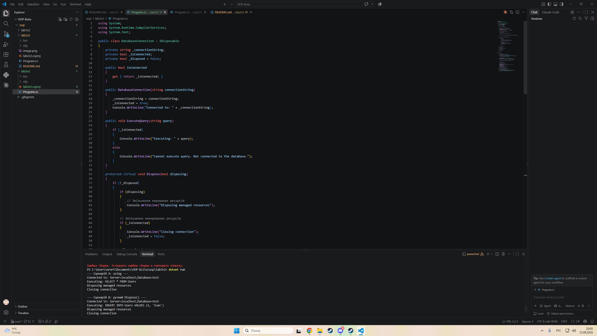

# Лабораторна робота №3

> **Тема:** Життєвий цикл об'єкта та керування ресурсами
> **Студент:** Варіант №2 (Клас `DatabaseConnection`)

---

## Зміст

- [Хід роботи та навички](#хід-роботи-та-навички)
- [Результати](#результати)
- [Контрольні запитання](#контрольні-запитання)

---

## Хід роботи та навички

### 1. Створив проєкт
Ініціалізував проєкт `lab3v2` у директорії `OOP-Bzita/oop/lab3v2` через .NET CLI.

```bash
dotnet new console -o OOP-Bzita/oop/lab3v2
```

### 2. Реалізував клас `DatabaseConnection`

- Описав приватні поля `_connectionString`, `_isConnected` та `_disposed`.
- Додав властивість `IsConnected` лише для читання.
- Конструктор "підключається" до бази: зберігає рядок підключення та встановлює `_isConnected = true`.
- Описав метод `ExecuteQuery()`, який виконує запит лише якщо є підключення.
- Реалізував патерн Dispose: інтерфейс `IDisposable`, методи `Dispose()` та `Dispose(bool disposing)`, деструктор `~DatabaseConnection()`.

### 3. Дослідив життєвий цикл

У `Main` продемонстрував три способи звільнення ресурсу: через `using`, ручним викликом `Dispose()` та через деструктор із `GC.Collect()` разом із `GC.WaitForPendingFinalizers()`.

```csharp
// A: using
using (var db = new DatabaseConnection("Server=localhost;Database=test"))
{
    db.ExecuteQuery("SELECT * FROM Users");
}

// B: ручний Dispose()
var db2 = new DatabaseConnection("Server=localhost;Database=test");
try { db2.ExecuteQuery("INSERT INTO Users VALUES (1, 'Ivan')"); }
finally { db2.Dispose(); }

// C: без Dispose(), спрацює деструктор
CreateWithoutDispose();
GC.Collect();
GC.WaitForPendingFinalizers();
```

---

## Результати



---

## Контрольні запитання

| № | Питання | Відповідь |
|---|---------|-----------|
| 1 | Інтерфейс `IDisposable` | Стандартний спосіб звільнення некерованих ресурсів. Містить метод `Dispose()`, який викликається явно або через `using`. |
| 2 | Оператор `using` | Гарантує виклик `Dispose()` після виходу з блоку, навіть якщо виникла виняткова ситуація. |
| 3 | Метод `Dispose(bool disposing)` | При `true` звільняє і керовані, і некеровані ресурси (виклик із `Dispose()`), при `false` лише некеровані (виклик із деструктора). |
| 4 | `GC.SuppressFinalize(this)` | Повідомляє GC, що ресурси вже звільнено, тому деструктор викликати не потрібно. |

---

<div align="center">

*Лабораторна робота виконана в рамках курсу ООП*

</div>