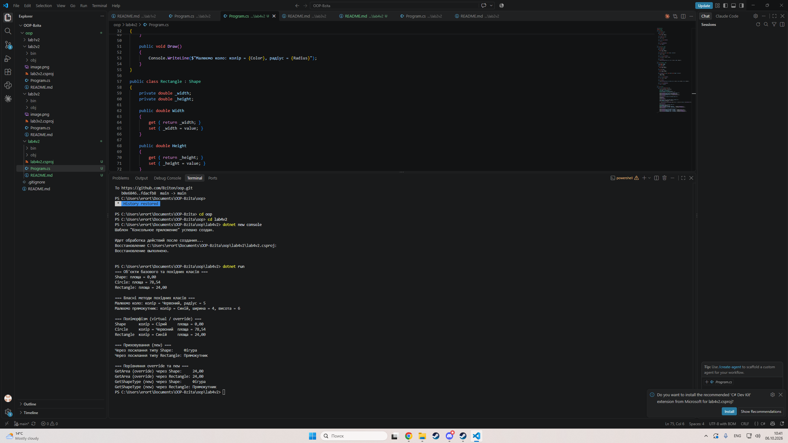

# Лабораторна робота №4

> **Тема:** Наслідування. Ключові слова base, override, virtual. Приховування членів (new).
> **Студент:** Варіант №2 (Ієрархія `Shape` → `Circle` → `Rectangle`)

---

## Зміст

- [Хід роботи та навички](#хід-роботи-та-навички)
- [Результати](#результати)
- [Контрольні запитання](#контрольні-запитання)

---

## Хід роботи та навички

### 1. Створив проєкт
Ініціалізував проєкт `lab4v2` у директорії `OOP-Bzita/oop/lab6v2` через .NET CLI згідно з вимогами.

```bash
dotnet new console -n lab6v2 -o OOP-Bzita/oop/lab6v2

2. Реалізував ієрархію класівОписав базовий клас Shape з приватною властивістю Color, конструктором та віртуальним методом virtual double GetArea().   Створив похідний клас Circle з властивістю Radius. Викликав конструктор базового класу за допомогою : base(color). Перевизначив метод площі через override double GetArea() та додав власний метод Draw().   Створив похідний клас Rectangle з властивостями Width та Height. Також використав base(color) та override double GetArea().   Для демонстрації приховування членів (new) створив звичайний метод GetShapeType() у базовому класі та метод new string GetShapeType() у класі Rectangle.   


3. Продемонстрував поліморфізм та приховування
У Main створив об'єкти базового та похідних класів. Продемонстрував поліморфну поведінку, викликаючи перевизначені методи через масив посилань на базовий клас Shape. Також показав різницю між override та new при виклику методів через посилання різних типів.

// Поліморфізм (override)
Shape[] shapes = { shape, circle, rectangle };
foreach (Shape item in shapes)
{
    Console.WriteLine($"Площа: {item.GetArea():F2}"); 
}

// Приховування (new)
Shape shapeRef = rectangle;
Rectangle rectangleRef = rectangle;
Console.WriteLine(shapeRef.GetShapeType());       
Console.WriteLine(rectangleRef.GetShapeType());

