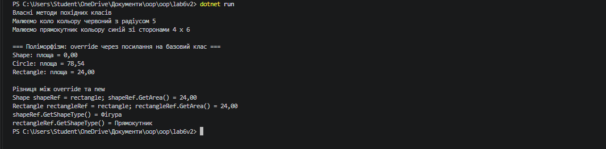

# Лабораторна робота №6

> **Тема:** Наслідування. Ключові слова `base`, `override`, `virtual`. Приховування членів (`new`)
> **Студент:** Варіант №2 (Ієрархія `Shape` → `Circle`, `Rectangle`)

---

## Зміст

- [Хід роботи та навички](#хід-роботи-та-навички)
- [Результати](#результати)
- [Контрольні запитання](#контрольні-запитання)

---

## Хід роботи та навички

### 1. Створив проєкт
Ініціалізував проєкт `lab6v2` у директорії `OOP-Bzita/oop/lab6v2` через .NET CLI.

```bash
dotnet new console -n lab6v2 -o OOP-Bzita/oop/lab6v2
```

### 2. Реалізував ієрархію класів

- Створив базовий клас `Shape` з приватним полем `_color`, публічною властивістю `Color`, конструктором, віртуальним методом `GetArea()` та звичайним методом `GetShapeType()`.
- Створив похідний клас `Circle` з полем `Radius`, перевизначеним методом `GetArea()` та власним методом `Draw()`.
- Створив похідний клас `Rectangle` з полями `Width`, `Height`, перевизначеним методом `GetArea()` та власним методом `Draw()`.
- У кожному похідному класі налаштував конструктор із викликом `: base(color)` для ініціалізації успадкованого поля.
- У класі `Rectangle` створив метод `GetShapeType()` із модифікатором `new`, що приховує однойменний метод базового класу.

```csharp
class Shape
{
    private string _color;

    public string Color
    {
        get { return _color; }
        set { _color = value; }
    }

    public Shape(string color)
    {
        _color = color;
    }

    public virtual double GetArea()
    {
        return 0;
    }

    public string GetShapeType()
    {
        return "Фігура";
    }
}

class Circle : Shape
{
    private double _radius;

    public double Radius
    {
        get { return _radius; }
        set { _radius = value; }
    }

    public Circle(string color, double radius) : base(color)
    {
        _radius = radius;
    }

    public override double GetArea()
    {
        return Math.PI * _radius * _radius;
    }

    public void Draw()
    {
        Console.WriteLine($"Малюємо коло кольору {Color} з радіусом {Radius}");
    }
}
```

### 3. Продемонстрував поліморфізм

У `Main` створив колекцію `List<Shape>`, додав до неї об'єкти `Shape`, `Circle` та `Rectangle`, у циклі `foreach` викликав `GetArea()`. Для кожного об'єкта виконалась власна реалізація методу відповідно до його фактичного типу.

```csharp
List<Shape> shapes = new List<Shape> { shape, circle, rectangle };
foreach (Shape s in shapes)
{
    Console.WriteLine($"{s.GetType().Name}: площа = {s.GetArea():F2}");
}
```

### 4. Продемонстрував різницю між `override` та `new`

Присвоїв об'єкт `Rectangle` двом змінним: типу `Shape` та типу `Rectangle`, і викликав через них обидва методи.

```csharp
Shape shapeRef = rectangle;
Rectangle rectangleRef = rectangle;

Console.WriteLine(shapeRef.GetArea());
Console.WriteLine(rectangleRef.GetArea());
Console.WriteLine(shapeRef.GetShapeType());
Console.WriteLine(rectangleRef.GetShapeType());
```

- `GetArea()` (`override`) повертає однаковий результат для обох посилань, бо метод визначається за фактичним типом об'єкта.
- `GetShapeType()` (`new`) повертає різні результати: через `Shape` викликається версія базового класу, через `Rectangle` — версія похідного, бо метод визначається за типом посилання.

---

## Результати

